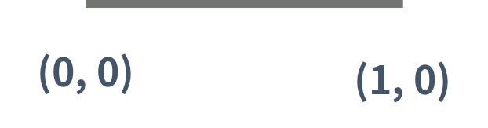

# 드래곤 커브

### Gold 3

드래곤 커브는 다음과 같은 세 가지 속성으로 이루어져 있으며, 이차원 좌표 평면 위에서 정의된다. 좌표 평면의 x축은 → 방향, y축은 ↓ 방향이다.

- 시작 점
- 시작 방향
- 세대

0세대 드래곤 커브는 아래 그림과 같은 길이가 1인 선분이다. 아래 그림은 (0, 0)에서 시작하고, 시작 방향은 오른쪽인 0세대 드래곤 커브이다.

<p align=center>
  
</p>

1세대 드래곤 커브는 0세대 드래곤 커브를 끝 점을 기준으로 시계 방향으로 90도 회전시킨 다음 0세대 드래곤 커브의 끝 점에 붙인 것이다. 끝 점이란 시작 점에서 선분을 타고 이동했을 때, 가장 먼 거리에 있는 점을 의미한다.

<p align=center>
  
</p>

2세대 드래곤 커브도 1세대를 만든 방법을 이용해서 만들 수 있다. (파란색 선분은 새로 추가된 선분을 나타낸다)

<p align=center>
  
</p>

3세대 드래곤 커브도 2세대 드래곤 커브를 이용해 만들 수 있다. 아래 그림은 3세대 드래곤 커브이다.

<p align=center>
  
</p>

즉, K(K > 1)세대 드래곤 커브는 K-1세대 드래곤 커브를 끝 점을 기준으로 90도 시계 방향 회전 시킨 다음, 그것을 끝 점에 붙인 것이다.

크기가 100×100인 격자 위에 드래곤 커브가 N개 있다. 이때, 크기가 1×1인 정사각형의 네 꼭짓점이 모두 드래곤 커브의 일부인 정사각형의 개수를 구하는 프로그램을 작성하시오. 격자의 좌표는 (x, y)로 나타내며, 0 ≤ x ≤ 100, 0 ≤ y ≤ 100만 유효한 좌표이다.

## 입력
첫째 줄에 드래곤 커브의 개수 N(1 ≤ N ≤ 20)이 주어진다. 둘째 줄부터 N개의 줄에는 드래곤 커브의 정보가 주어진다. 드래곤 커브의 정보는 네 정수 x, y, d, g로 이루어져 있다. x와 y는 드래곤 커브의 시작 점, d는 시작 방향, g는 세대이다. (0 ≤ x, y ≤ 100, 0 ≤ d ≤ 3, 0 ≤ g ≤ 10)

입력으로 주어지는 드래곤 커브는 격자 밖으로 벗어나지 않는다. 드래곤 커브는 서로 겹칠 수 있다.

방향은 0, 1, 2, 3 중 하나이고, 다음을 의미한다.

- 0: x좌표가 증가하는 방향 (→)
- 1: y좌표가 감소하는 방향 (↑)
- 2: x좌표가 감소하는 방향 (←)
- 3: y좌표가 증가하는 방향 (↓)

## 출력
첫째 줄에 크기가 1×1인 정사각형의 네 꼭짓점이 모두 드래곤 커브의 일부인 것의 개수를 출력한다.

## 예제
```
4
3 3 0 1
4 2 1 3
4 2 2 1
2 7 3 4
```
```
11
```
<p align=center>
  
</p>

## 문제풀이
좌표 회전 공식을 사용하여 문제를 해결했다.

맨처음에 0세개 드래곤 커브를 `point_list`에 저장하고 맨 끝 점을 기준으로 점들을 역순으로 순회하며 90도 회전시켰다. 90도 회전은 두 점사이 벡터를 구해서 90도 회전을 시켜 다시 기준 점에 해당 벡터를 더해 구하였다. 이를 g번 반복하여 드래곤 커브 내 좌표들을 구해서 2차원 배열에 저장하였다. 모든 드래곤 커브를 순회한 후에 이차원 배열을 돌며 1 x 1 정사각형이 있는지 순회하여 답을 구하였다.