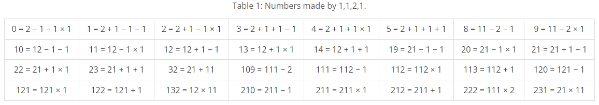

# Make Numbers

### Gold

Peter is a math teacher at an elementary school. To familiarize students with three basic arithmetic operations plus (+), minus (−) and times (×), he gives a simple arithmetic puzzle as homework. The puzzle is that you are given 4 digits, and you are told to build as many non-negative integers as possible using just those 4 digits and at least one of the three basic arithmetic operations. For example, you are given 1,1,2,1 as the digits, and then you can build 32 non-negative integers as Table 1.

Table 1: Numbers made by 1,1,2,1.

To check whether the student’s answer includes all possible integers, Peter needs to know the total number of non-negative integers that can be built for the puzzle. Please write a program to help Peter compute the total number.

## Input
The input file contains 4 integers separated by a space in a line, which indicates the given digits.

## Output
Output the total number of non-negative integers that can be built.

## Limitation
- The expressions are composed by concatenating the 4 given digits and at least one operation in {+, −, ×}. The given digits are the elements in {1, 2, 3, . . . 9}.
- The given digits are partitioned into several groups and the digits in each group are concatenated as a number in arbitrarily permutation order.
- The symbol − can only be treated as a minus operator.
- The operations + and − have equal precedence.
- The operation × has higher precedence than + and −.
- Operations with the highest precedence are evaluated first, and operations with equal precedence are evaluated from left to right.
  
## Solution
`DFS`방식으로 모든 수식을 `result`에 저장하여 `eval`로 계산하여 풀었다.  
직전에 합해진 문자가 operation이면 숫자만 더하고 아니면 숫자 또는 operation을 더한다.  
`ch`를 이용하여 숫자가 중복으로 더해지지 않게 하였고, 더해진 숫자가 4개가 되면 계산하여 `set` 데이터 타입의 `res`에 결과값을 저장하였다.