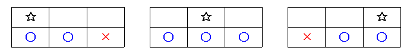

# 내려가기

### Gold 5

N줄에 0 이상 9 이하의 숫자가 세 개씩 적혀 있다. 내려가기 게임을 하고 있는데, 이 게임은 첫 줄에서 시작해서 마지막 줄에서 끝나게 되는 놀이이다.

먼저 처음에 적혀 있는 세 개의 숫자 중에서 하나를 골라서 시작하게 된다. 그리고 다음 줄로 내려가는데, 다음 줄로 내려갈 때에는 다음과 같은 제약 조건이 있다. 바로 아래의 수로 넘어가거나, 아니면 바로 아래의 수와 붙어 있는 수로만 이동할 수 있다는 것이다. 이 제약 조건을 그림으로 나타내어 보면 다음과 같다.

별표는 현재 위치이고, 그 아랫 줄의 파란 동그라미는 원룡이가 다음 줄로 내려갈 수 있는 위치이며, 빨간 가위표는 원룡이가 내려갈 수 없는 위치가 된다. 숫자표가 주어져 있을 때, 얻을 수 있는 최대 점수, 최소 점수를 구하는 프로그램을 작성하시오. 점수는 원룡이가 위치한 곳의 수의 합이다.

## 입력
첫째 줄에 N(1 ≤ N ≤ 100,000)이 주어진다. 다음 N개의 줄에는 숫자가 세 개씩 주어진다. 숫자는 0, 1, 2, 3, 4, 5, 6, 7, 8, 9 중의 하나가 된다.

## 출력
첫째 줄에 얻을 수 있는 최대 점수와 최소 점수를 띄어서 출력한다.

## 문제풀이
다이나믹 프로그래밍으로 문제를 해결했다.

최소값과 최대값 둘 다 필요하므로 값 두 개를 저장하는 리스트 세 개를 원소로 갖는 리스트를 만들었다. 이 값이 변화하면서 다음 계산에 영향을 줄 수 있기 때문에 같은 형태의 임시 리스트를 만들었다. 가장 안 리스트가 갖는 두 개의 값은 각각 최소값, 최대값을 의미하고 리스트 세 개는 해당 위치의 칸을 의미한다.

이를 토대로 전에 저장한 최소값 중 해당 칸으로 내려올 수 있는 같은 위치의 칸과 그 양 옆 칸의 값 증 최소값들의 최소값과 최대값들의 최대값을 가져와 원래 그 칸의 값을 더하는 것을 진행하고 이를 저장한 임시 리스트의 값을 원래 결과 저장 리스트에 복사했다. 모든 반복이 끝나고 최대값들의 최대값과 최소값들의 최소값을 출력했다.