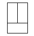
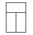
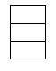
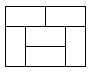
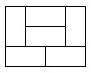

# 타일 채우기

### Gold 4

3×N 크기의 벽을 2×1, 1×2 크기의 타일로 채우는 경우의 수를 구해보자.

## 입력
첫째 줄에 N(1 ≤ N ≤ 30)이 주어진다.

## 출력
첫째 줄에 경우의 수를 출력한다.

## 문제풀이
다이나믹 프로그래밍으로 문제를 해결했다.

먼저 사용하는 타일은 2칸짜리인데 N이 홀수이면 채워야하는 칸이 총 홀수이므로 모두를 채우는 경우는 없다. 따라서 N이 홀수인 경우는 모두 무시했다.

2칸을 채우는 방법은 총 3가지 방법이 있다.

    
    
    

따라서 길이가 N인 타일은 길이가 N-2인 타일에 위 세 가지 방법을 덧붙이는 경우가 존재한다.

    
    

그리고 위와 같이 저 길이 이하로 나뉘지 않는 경우가 2가지 존재한다. 이는 길이가 4 이상인 경우에 모두 존재한다. 따라서 길이가 N인 타일은 길이가 N-4 이하인 타일에 두 가지 경우의 타일들을 붙여서 만드는 경우가 존재한다.

결론적으로 길이가 N(짝수)인 타일 배열의 개수는 길이가 N-2인 타일 배열의 개수 X 3 + 길이가 N-4이하의 짝수인 모든 타일 배열의 개수의 두 배의 합이다.

이를 4부터 계속해서 답을 도출할 수 있다.