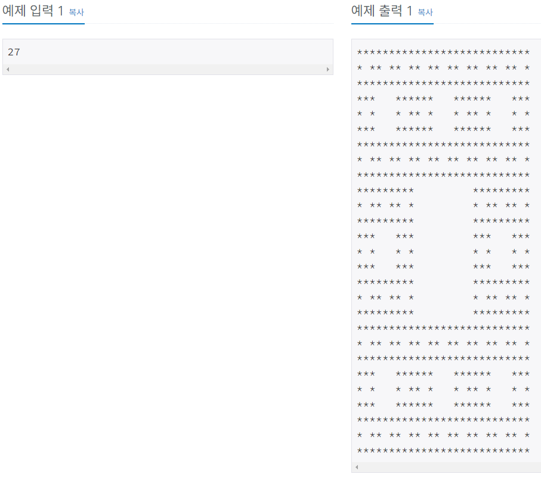

# 별 찍기 - 10

### Gold 5

재귀적인 패턴으로 별을 찍어 보자. N이 3의 거듭제곱(3, 9, 27, ...)이라고 할 때, 크기 N의 패턴은 N×N 정사각형 모양이다.

크기 3의 패턴은 가운데에 공백이 있고, 가운데를 제외한 모든 칸에 별이 하나씩 있는 패턴이다.

```
***
* *
***
```
N이 3보다 클 경우, 크기 N의 패턴은 공백으로 채워진 가운데의 (N/3)×(N/3) 정사각형을 크기 N/3의 패턴으로 둘러싼 형태이다. 예를 들어 크기 27의 패턴은 예제 출력 1과 같다.

## example


## 문제풀이

기본 템플릿으로 `N = 3`일때의 모양을 잡고 이를 반복적으로 처리하였다.
처리할 때는 같은 모양을 9개 반복하고 가운데 모양을 제거하였다.

- 가운데 모양을 제거하기 위해 현재 길이의 1/3의 값으로 나눌 때의 나머지를 이용

마지막에는 join 메소드를 사용하여 하나의 모양으로 만들었다.