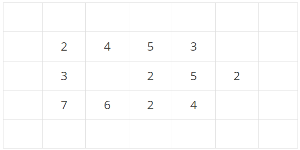
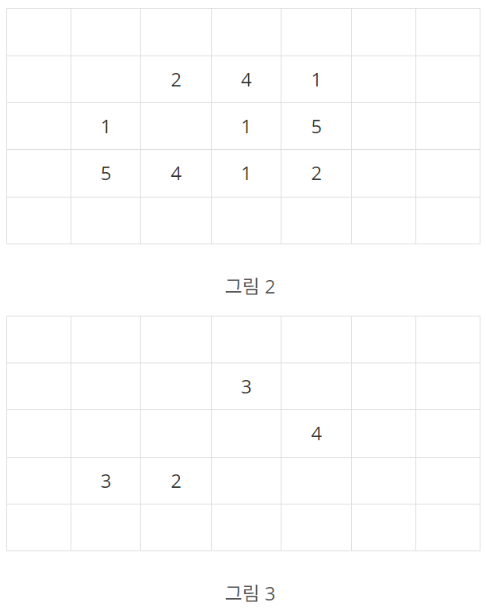

# 빙산

### Gold 4

지구 온난화로 인하여 북극의 빙산이 녹고 있다. 빙산을 그림 1과 같이 2차원 배열에 표시한다고 하자. 빙산의 각 부분별 높이 정보는 배열의 각 칸에 양의 정수로 저장된다. 빙산 이외의 바다에 해당되는 칸에는 0이 저장된다. 그림 1에서 빈칸은 모두 0으로 채워져 있다고 생각한다.

   
  그림 1. 행의 개수가 5이고 열의 개수가 7인 2차원 배열에 저장된 빙산의 높이 정보

빙산의 높이는 바닷물에 많이 접해있는 부분에서 더 빨리 줄어들기 때문에, 배열에서 빙산의 각 부분에 해당되는 칸에 있는 높이는 일년마다 그 칸에 동서남북 네 방향으로 붙어있는 0이 저장된 칸의 개수만큼 줄어든다. 단, 각 칸에 저장된 높이는 0보다 더 줄어들지 않는다. 바닷물은 호수처럼 빙산에 둘러싸여 있을 수도 있다. 따라서 그림 1의 빙산은 일년후에 그림 2와 같이 변형된다.

그림 3은 그림 1의 빙산이 2년 후에 변한 모습을 보여준다. 2차원 배열에서 동서남북 방향으로 붙어있는 칸들은 서로 연결되어 있다고 말한다. 따라서 그림 2의 빙산은 한 덩어리이지만, 그림 3의 빙산은 세 덩어리로 분리되어 있다.

  

한 덩어리의 빙산이 주어질 때, 이 빙산이 두 덩어리 이상으로 분리되는 최초의 시간(년)을 구하는 프로그램을 작성하시오. 그림 1의 빙산에 대해서는 2가 답이다. 만일 전부 다 녹을 때까지 두 덩어리 이상으로 분리되지 않으면 프로그램은 0을 출력한다.

## 입력
첫 줄에는 이차원 배열의 행의 개수와 열의 개수를 나타내는 두 정수 N과 M이 한 개의 빈칸을 사이에 두고 주어진다. N과 M은 3 이상 300 이하이다. 그 다음 N개의 줄에는 각 줄마다 배열의 각 행을 나타내는 M개의 정수가 한 개의 빈 칸을 사이에 두고 주어진다. 각 칸에 들어가는 값은 0 이상 10 이하이다. 배열에서 빙산이 차지하는 칸의 개수, 즉, 1 이상의 정수가 들어가는 칸의 개수는 10,000 개 이하이다. 배열의 첫 번째 행과 열, 마지막 행과 열에는 항상 0으로 채워진다.

## 출력
첫 줄에 빙산이 분리되는 최초의 시간(년)을 출력한다. 만일 빙산이 다 녹을 때까지 분리되지 않으면 0을 출력한다.

## 문제풀이
빙산이 녹는 과정을 나타내는 함수인 `simul`과 빙산 덩어리의 개수를 세는 `calc`함수로 나누어 진행했다.

### `simul`
이차원 배열을 순서대로 순회하다 빙산을 만나면 주변의 있는 바다만큼 녹은 값을 새로운 배열에 저장하고 반복이 끝난 뒤 반환한다.

### `calc`
이차원 배열을 순회하다 빙산을 만나면 넓이 우선 탐색으로 연결된 빙산들을 모두 순회한다. 이러한 연산이 있을 때마다 카운트하여 총 카운트한 값을 반환한다.

이 두 함수를 사용하여 만약에 빙산의 덩어리의 개수가 0이면 0을 출력했고 2이상 이면 그때까지 카운트한 값을 출력했다.