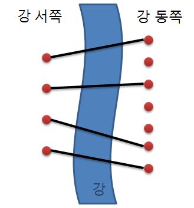
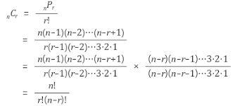

# 다리 놓기

재원이는 한 도시의 시장이 되었다. 이 도시에는 도시를 동쪽과 서쪽으로 나누는 큰 일직선 모양의 강이 흐르고 있다. 하지만 재원이는 다리가 없어서 시민들이 강을 건너는데 큰 불편을 겪고 있음을 알고 다리를 짓기로 결심하였다. 강 주변에서 다리를 짓기에 적합한 곳을 사이트라고 한다. 재원이는 강 주변을 면밀히 조사해 본 결과 강의 서쪽에는 N개의 사이트가 있고 동쪽에는 M개의 사이트가 있다는 것을 알았다. (N ≤ M)

재원이는 서쪽의 사이트와 동쪽의 사이트를 다리로 연결하려고 한다. (이때 한 사이트에는 최대 한 개의 다리만 연결될 수 있다.) 재원이는 다리를 최대한 많이 지으려고 하기 때문에 서쪽의 사이트 개수만큼 (N개) 다리를 지으려고 한다. 다리끼리는 서로 겹쳐질 수 없다고 할 때 다리를 지을 수 있는 경우의 수를 구하는 프로그램을 작성하라.

## 문제풀이
M개의 다리 중 N개 만큼 고르는 문제
교차되면 안된다 -> 순서는 자동으로 정렬된다고 여겨야 한다.
따라서 조합 개수를 구하는 공식 M**C**N을 사용하였다.

