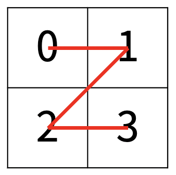

# Z

### Silver 1

한수는 크기가 2N × 2N인 2차원 배열을 Z모양으로 탐색하려고 한다. 예를 들어, 2×2배열을 왼쪽 위칸, 오른쪽 위칸, 왼쪽 아래칸, 오른쪽 아래칸 순서대로 방문하면 Z모양이다.

    

 

N > 1인 경우, 배열을 크기가 2N-1 × 2N-1로 4등분 한 후에 재귀적으로 순서대로 방문한다.

다음 예는 22 × 22 크기의 배열을 방문한 순서이다.

    

 

N이 주어졌을 때, r행 c열을 몇 번째로 방문하는지 출력하는 프로그램을 작성하시오.

다음은 N=3일 때의 예이다.

    

 

## 입력
첫째 줄에 정수 N, r, c가 주어진다.

## 출력
r행 c열을 몇 번째로 방문했는지 출력한다.

## 제한
- 1 ≤ N ≤ 15
- 0 ≤ r, c < 2N

## 문제풀이
4구역으로 나누었을 때 어디에 속하는 지를 저장하며 진행하였다. 전체 구역에서 시작해서 (r, c)가 속한 구역을 골라 다시 4등분해 가며 순서대로 0, 1, 2, 3이라고 번호를 매겼다. 그리고 저장된 값은 4진수의 숫자로 볼 수 있기 때문에 `int(res, 4)`로 4진수에서 10진수로 바꾸어 출력하였다.