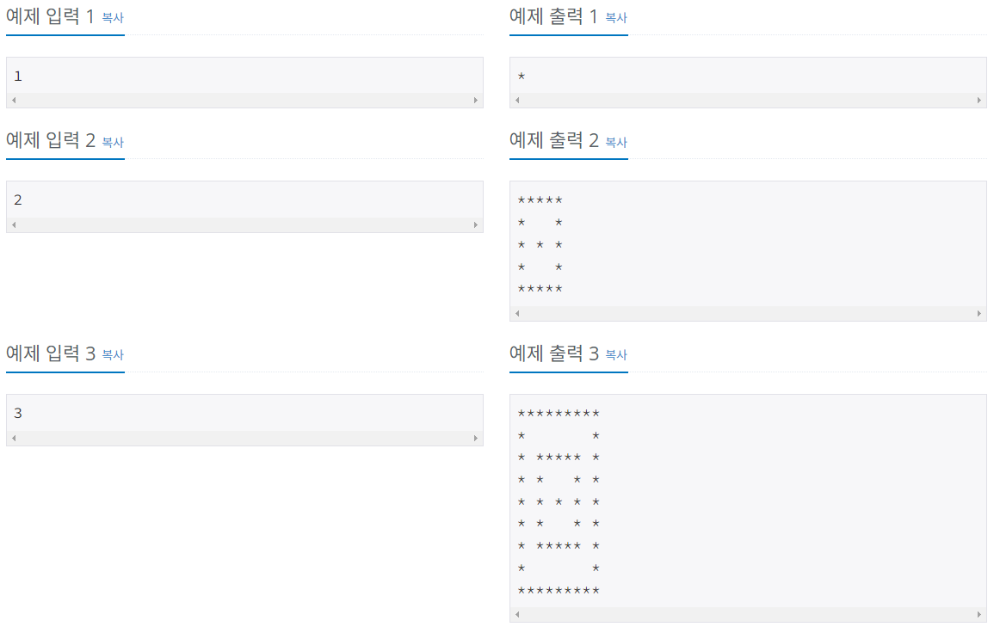
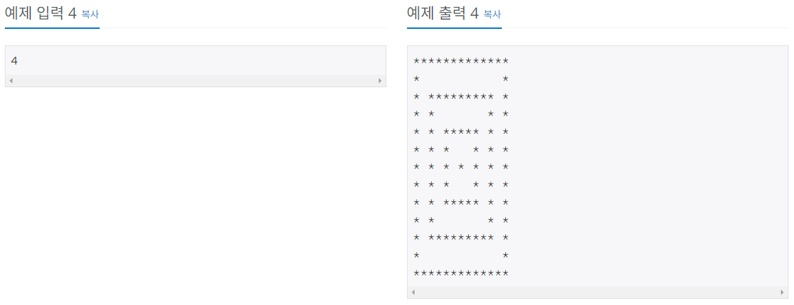

# 별 찍기 - 19

### Silver 4

예제를 보고 규칙을 유추한 뒤에 별을 찍어 보세요.

## 입력
첫째 줄에 N(1 ≤ N ≤ 100)이 주어진다.

## 출력
첫째 줄부터 차례대로 별을 출력한다.

## 문제풀이
`' '`과 `'*'`로 주변을 싸는 코드를 `wrapping` 함수로 작성하였다.  
`wrapping` 함수는 두 부분으로 나뉘는데 위는 `' '`, 아래는 `'*'`로 둘러싼다.  
둘러싸는 코드는 리스트 요소에 앞뒤로 추가하였고 위아래 하나씩 행을 추가하였다.  
출력은 `join` 메소드로 출력하였다.