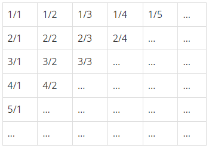

# 분수찾기

### Silver 5

무한히 큰 배열에 다음과 같이 분수들이 적혀있다.

이와 같이 나열된 분수들을 1/1 → 1/2 → 2/1 → 3/1 → 2/2 → … 과 같은 지그재그 순서로 차례대로 1번, 2번, 3번, 4번, 5번, … 분수라고 하자.

X가 주어졌을 때, X번째 분수를 구하는 프로그램을 작성하시오.

## 입력
첫째 줄에 X(1 ≤ X ≤ 10,000,000)가 주어진다.

## 출력
첫째 줄에 분수를 출력한다.

## 문제풀이
`cnt`를 이용하여 몇 번째 지그재그인지를 계산했다. `cnt`를 1씩 증가시키면서 `N`에서 빼는 것을 `N`이 `cnt`보다 작아질 때까지 반복했다. 이를 바탕으로 `cnt`가 짝수이면 `f"{N}/{cnt+1-N}"` 홀수이면 `f"{cnt+1-N}/{N}"`을 출력해서 지그재그인 것을 고려했다.