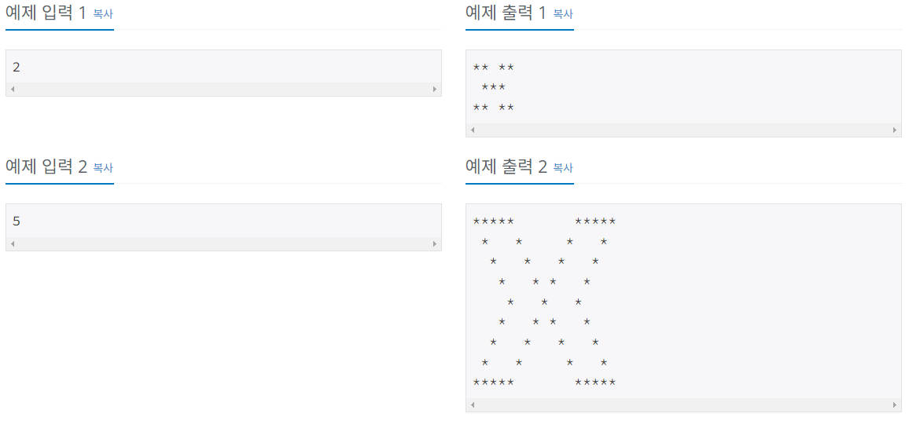

# 별 찍기 - 23

### Silver 4

예제를 보고 규칙을 유추한 뒤에 별을 찍어 보세요.

## 입력
첫째 줄에 N(2 ≤ N ≤ 100)이 주어진다.

## 출력
규칙대로 별을 출력한다.

## 문제풀이
작성한 코드는 윗부분, 중간 줄, 아랫부분으로 나뉜다. (중간 줄은 별개수가 달라 따로 코딩)  
`end=''` 로 처리하여 한 줄에 출력되도록 한다.  
처음 공백은 `i` 에 따라 개수가 달라지게 하여 산모양이 나오게 하였고  
처음이나 끝에서만 공백이 아닌 별로 채워지게 하였다.  
좌우 대칭이기에 한번 더 비슷하게 코드를 작성하였다.