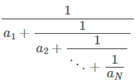

# 제리와 톰 2

### Silver

톰은 마트에서 치즈 1kg 을 사서 집으로 돌아왔습니다.

그런데 톰이 한눈을 판 사이 제리가 와서 밑의 수식의 값kg 만큼 훔쳐갔습니다.

제리가 치즈를 훔쳐 간 후 톰이 가지고 있는 치즈의 무게는 얼마인가요?

## 입력
첫 번째 줄에 정수 N (2 ≤ N ≤ 15) 가 주어집니다.  
두 번째 줄에는 정수 a1, a2, ..., aN (1 ≤ ai ≤ 9) 이 주어집니다.

## 출력
정답을 기약분수로 표현했을 때 P/Q kg 이라면 첫 번째 줄에 P와 Q를 공백을 사이에 두고 출력합니다.

## 문제풀이
재귀함수를 사용하였다.  
Base는 입력되는 숫자 리스트의 길이가 1일 때, 1과 aN을 반환한다.  
그리고 기약분수를 고려하지 않고 셈을 하여 `P`, `Q`를 구하였다.  
나머지를 출력해야 하므로 마지막에 `Q-P`, `Q`를 출력하는데 기약분수여야하므로 `gcd`함수를 사용하였다.