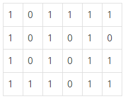

# 미로 탐색

### Silver 1

N×M크기의 배열로 표현되는 미로가 있다.

미로에서 1은 이동할 수 있는 칸을 나타내고, 0은 이동할 수 없는 칸을 나타낸다. 이러한 미로가 주어졌을 때, (1, 1)에서 출발하여 (N, M)의 위치로 이동할 때 지나야 하는 최소의 칸 수를 구하는 프로그램을 작성하시오. 한 칸에서 다른 칸으로 이동할 때, 서로 인접한 칸으로만 이동할 수 있다.

위의 예에서는 15칸을 지나야 (N, M)의 위치로 이동할 수 있다. 칸을 셀 때에는 시작 위치와 도착 위치도 포함한다.

## 입력
첫째 줄에 두 정수 N, M(2 ≤ N, M ≤ 100)이 주어진다. 다음 N개의 줄에는 M개의 정수로 미로가 주어진다. 각각의 수들은 **붙어서** 입력으로 주어진다.

## 출력
첫째 줄에 지나야 하는 최소의 칸 수를 출력한다. 항상 도착위치로 이동할 수 있는 경우만 입력으로 주어진다.

## 문제풀이
BFS의 방식으로 문제를 해결했다.

첫 번째 칸에서 시작하여 주변 4방향으로 검사하여 갈 수 있는 길이면 `dQ`에 넣어서 다시 탐색하였다. 그리고 진행한 거리를 계산해야 하므로 while문 안에 for문을 넣어 같은 거리에 있는 칸을 계산한 뒤 `res += 1`을 실행하여 거리값을 구할 수 있도록 하였다.