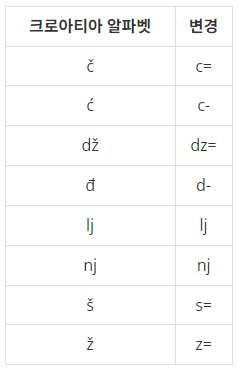

# 크로아티아 알파벳

### Silver 5

예전에는 운영체제에서 크로아티아 알파벳을 입력할 수가 없었다. 따라서, 다음과 같이 크로아티아 알파벳을 변경해서 입력했다.

예를 들어, ljes=njak은 크로아티아 알파벳 6개(lj, e, š, nj, a, k)로 이루어져 있다. 단어가 주어졌을 때, 몇 개의 크로아티아 알파벳으로 이루어져 있는지 출력한다.

dž는 무조건 하나의 알파벳으로 쓰이고, d와 ž가 분리된 것으로 보지 않는다. lj와 nj도 마찬가지이다. 위 목록에 없는 알파벳은 한 글자씩 센다.

## 입력
첫째 줄에 최대 100글자의 단어가 주어진다. 알파벳 소문자와 '-', '='로만 이루어져 있다.

단어는 크로아티아 알파벳으로 이루어져 있다. 문제 설명의 표에 나와있는 알파벳은 변경된 형태로 입력된다.

## 출력
입력으로 주어진 단어가 몇 개의 크로아티아 알파벳으로 이루어져 있는지 출력한다.

## 문제풀이
최초의 결과값은 총 글자 수로 정합니다.  
글자들을 검색하며 해당 글자가 크로아티아 알파벳의 첫글자인지 검사합니다.  
만약 맞을 경우 다음 글자까지 크로아티아 알파벳에 해당하는지 검사해서 결과값에서 1을 뺍니다.  

dz=의 경우 총 세글자를 검사합니다. 하지만 z=를 포함하는 알파벳이기에 다음 반복에서 1이 빠지게 되므로  
2를 빼지않고 1을 뺍니다.